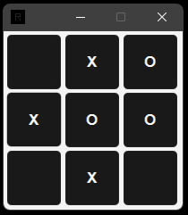

# TicTacToe Game

This is a simple TicTacToe game implemented in Java using JavaFX for the graphical user interface and CSS for styling.


## Prerequisites

- Java 17 or higher
- Maven
#


## Getting Started

### Clone the repository

```sh
git clone https://github.com/r4ppz19/TicTacToe.git
cd TicTacToe
```

### Build the project
```sh
mvn clean install
```

### Run the application
```sh
mvn javafx:run
```


